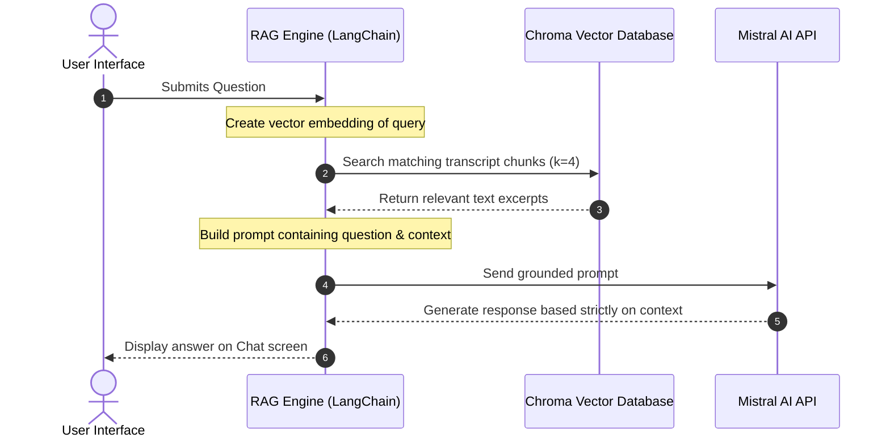

# 🎬 AI Video Assistant & Meeting Intelligence Workspace

An advanced full-stack AI Meeting Assistant designed to process YouTube links, local video files, or audio uploads. Using a state-of-the-art **RAG (Retrieval-Augmented Generation)** pipeline combined with local speech-to-text models, the app transcribes, summarizes, extracts action items/key decisions, and provides an interactive conversational interface to chat directly with your meetings.

---

## 📸 System Architecture & Data Flow

### 1. Processing Pipeline
Below is the data flow showing how media inputs are processed and transformed into actionable intelligence:

```mermaid
graph TD
    %% Styling
    classDef input fill:#1e1b4b,stroke:#7c3aed,stroke-width:2px,color:#fff;
    classDef proc fill:#0c0a0f,stroke:#2a2a3a,stroke-width:1px,color:#94a3b8;
    classDef model fill:#111827,stroke:#06b6d4,stroke-width:2px,color:#fff;
    classDef out fill:#064e3b,stroke:#10b981,stroke-width:2px,color:#fff;

    A[Input: YT URL / Upload / Local File] :::input --> B(Audio Processor: yt-dlp & pydub) :::proc
    B --> C[Audio Chunks ~10 mins] :::proc
    C --> D(Groq API: Whisper-Large-V3) :::model
    D --> E[Full English Transcript] :::proc
    
    %% RAG Fork
    E --> F[Chroma Vector Store] :::model
    E --> G(Mistral AI: mistral-small-latest) :::model
    
    %% Embeddings
    H[HuggingFace: all-MiniLM-L6-v2 Embeddings] :::model --> F
    
    %% Summaries Fork
    G --> I[Executive Summary] :::out
    G --> J[Action Items & Owners] :::out
    G --> K[Key Decisions & Questions] :::out
    
    %% Q&A Fork
    F --> L(RAG Engine: LangChain LCEL) :::proc
    L --> M[Interactive Chat Assistant] :::out
    
    %% Exporters
    I & J & K & E --> N(PDF / MD / JSON Exporters) :::proc
```

### 2. Conversational RAG Sequence
Here is the sequence diagram illustrating how the local retriever interacts with the large language model to answer user questions:



---

## ✨ Key Features

- **🚀 Premium Glassmorphism UI**: High-fidelity dark mode with visual glows, micro-interactions, responsive grids, and custom styling overrides.
- **📁 Multi-Source Media Uploads**: Streamlined file uploader (`st.file_uploader`) alongside YouTube URLs and absolute local paths.
- **🎙️ English Translation & Speech Transcription**: Automatic segmentation and high-accuracy transcription of multilingual meetings (English, Hindi, Hinglish) using Groq's Whisper Large V3.
- **📋 Automatic Document Segmentation & Summarization**: Recursive chunk splitters and map-reduce chains summarize lengthy discussions into clear, readable highlights.
- **🔍 Transcript Search Explorer**: Real-time interactive word search that highlights matches in the full transcript.
- **🧠 Interactive RAG Chat**: Chat assistant grounded strictly in the transcript context, equipped with pre-loaded prompt chips for quick insights.
- **📂 Meeting History Manager**: Local JSON database that caches analyzed meetings so they can be reloaded instantly without re-processing.
- **📤 Export Center**: One-click download buttons to save reports as beautifully compiled PDFs (using custom `fpdf2` rendering), Markdown, or raw JSON.

---

## 🛠️ Technology Stack

- **Frontend Interface**: [Streamlit](https://streamlit.io/) (v1.35+)
- **Speech-to-Text**: [Groq API](https://groq.com/) (Whisper Large V3)
- **Large Language Model**: [Mistral AI](https://mistral.ai/) (`mistral-small-latest` via LangChain)
- **Vector Database**: [ChromaDB](https://www.trychroma.com/) (Local persistent storage)
- **Embeddings Model**: Sentence Transformers (`all-MiniLM-L6-v2` via CPU)
- **Orchestration**: [LangChain](https://www.langchain.com/) (LCEL, Prompts, Parsers, & Text Splitters)
- **Audio Manipulation**: [Pydub](http://pydub.com/) & [yt-dlp](https://github.com/yt-dlp/yt-dlp)
- **Document Export**: [FPDF2](https://github.com/py-pdf/fpdf2)

---

## 📂 Project Structure

```
├── .env                  # API Credentials (GROQ_API_KEY, MISTRAL_API_KEY)
├── .gitignore            # Excluded files (caches, downloads, DBs, keys)
├── app.py                # Premium Streamlit UI application entry point
├── main.py               # CLI runner for local script execution
├── test.py               # CLI testing suite
├── requirements.txt      # Python dependencies manifest
├── core/                 # AI & LLM Engine Files
│   ├── transcriber.py    # Local Whisper segmenter & Groq translation caller
│   ├── summarizer.py     # Map-reduce langchain summary chains
│   ├── extractor.py      # Bullet-point analyzers (actions, decisions, Qs)
│   ├── vector_store.py   # Chroma DB setup and CPU embeddings builder
│   └── rag_engine.py     # RAG model prompt pipelines
├── utils/                # System Utilities
│   ├── audio_processor.py# YouTube downloader and audio formats converter
│   ├── pdf_generator.py  # Custom PDF report rendering system
│   └── history_manager.py# Local JSON database caching meeting results
├── downloads/            # Local directory for cached audio/video files
└── history/              # Local directory for cached meeting analysis JSONs
```

---

## 🚀 Setup & Installation

### 1. System Prerequisites
- **Python**: Version `3.10` or higher.
- **FFmpeg**: Required by `pydub` and `yt-dlp` for audio processing.
  - *Windows*: Install via `winget install Gyan.FFmpeg` or download from Gyan.dev and add it to your System PATH.

### 2. Installation Steps
Clone the repository and navigate to the project directory:
```powershell
# Initialize virtual environment
python -m venv .venv

# Activate virtual environment
.venv\Scripts\activate

# Upgrade pip and install requirements
python -m pip install --upgrade pip
python -m pip install -r requirements.txt
```

### 3. API Keys Configuration
Create a `.env` file in the root folder of the project and add your API keys:
```env
GROQ_API_KEY="your_groq_api_key_here"
MISTRAL_API_KEY="your_mistral_api_key_here"
```

---

## 🏃 Running the Application

### 🖥️ Streamlit Web App (Recommended)
Run the following command to start the interactive web workspace:
```powershell
streamlit run app.py
```
Open your browser and navigate to **http://localhost:8501** to view the application.

### 💻 Command Line Interface (CLI)
You can also run the pipeline in your terminal using the console client:
```powershell
python main.py
```
This will run the transcript pipeline and open an interactive chat session inside your terminal window.

---

## 🛡️ License & Contributions
This project is open-source. Contributions, issues, and feature requests are welcome!
